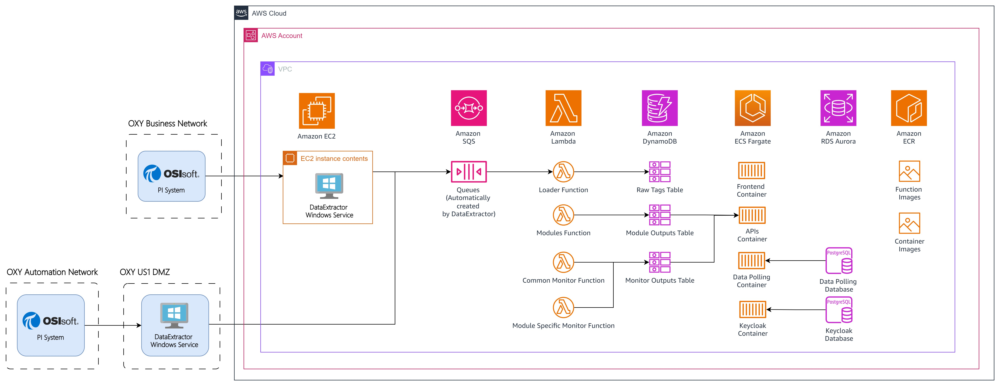

<h1 align="center">
   <a href="#">Template para Infrastrutura como Código</a><br />
   <small>(Terraform)</small>
</h1>

<p align="center">
 <a href="#about">Sobre</a> 
 <a href="#how-it-works">Como Funciona</a> 
 <a href="#tech-stack">Documentação</a>


## Sobre

O projeto utiliza o Padrão de Solução VPC da AWS para implementar sua arquitetura. Esse padrão fornece um ambiente de rede seguro e isolado para os recursos do projeto. Ele permite a segmentação de recursos em sub-redes diferentes, possibilitando um melhor controle sobre o tráfego e o acesso à rede.


Além do Padrão de Solução AWS VPC, o projeto segue uma abordagem serverless. Isso significa que, em vez de gerenciar e provisionar servidores, o projeto utiliza serviços da AWS como AWS Lambda, AWS API Gateway e AWS DynamoDB para construir soluções escaláveis e econômicas. Ao adotar uma arquitetura serverless, o projeto se beneficia de escalabilidade automática, redução da sobrecarga operacional e modelo de preços pay-per-use.




## Como funciona

1. Instalar opentofu: https://opentofu.org/docs/intro/install/
2. Instalar aws cli: https://docs.aws.amazon.com/cli/latest/userguide/getting-started-install.html
3. Docker: https://docs.docker.com/engine/install/
4. Configurar aws profile: `aws configure --profile=YOUR_PROFILE_NAME`
5. Clonar repositório: `git clone <URL para clone>`
6. Acesse a pasta `nome-da-pasta`
7. Dentro da localização do repositório, crie o arquivo `ENVIRONMENT_NAME.s3.tfbackend` com um conteúdo de exemplo:
    ```
    bucket = "bucket-name-to-store-tfstate-tf-state"
    key = "ENVIRONMENT_NAME.tfstate"
    region = "us-east-1"
    profile = "YOUR_PROFILE_NAME" #mesmo do passo 3
    ```
8. Execute o seguinte comando para criar o bucket com versionamento ativado:
    ```
    aws s3api create-bucket --bucket bucket-name-to-store-tfstate-tf-state --profile YOUR_PROFILE_NAME

    aws s3api put-bucket-versioning --bucket bucket-name-to-store-tfstate-tf-state --versioning-configuration --profile YOUR_PROFILE_NAME
    ```
9. Dentro do local do repositório, crie o arquivo `ENVIRONMENT_NAME.tfvars` com conteúdo de exemplo:
    ```
    environment = "ENVIRONMENT_NAME"
    region = "us-east-1"
    dns_zone_name = "your-domain"
    initial_db_name = "INITIAL_DB_NAME"
    master_username = "MASTER_DB_USERNAME"
    master_password = "MASTER_DB_PASSWORD"
    ```
10. Execute: `tofu init -backend-config=./ENVIRONMENT_NAME.s3.tfbackend`
11. Execute: `tofu apply -var-file ENVIRONMENT_NAME.tfvars`

## Documentações
- [Terraform (Opentofu)](https://opentofu.org/)
- [AWS Cli](https://aws.amazon.com/pt/cli/)